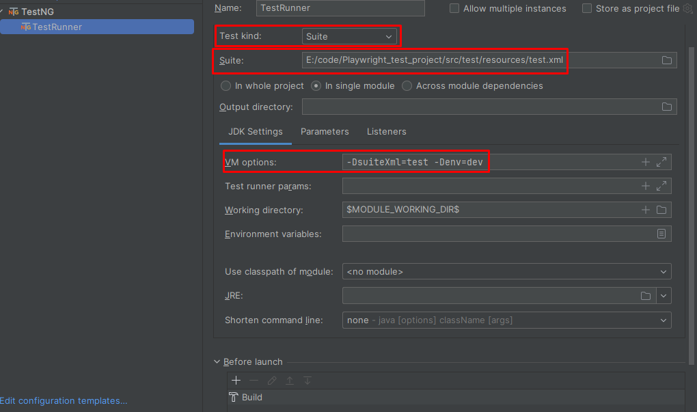

# Playwright test project
1. Реализована возможность через Owner библиотеку загружать разные профили пользователя (dev, prod, test). Для запуска тестов с разными профилями использовать команду mvn clean test -Dtest=Just -Denv={dev, test, prod} через тестовый класс Just можно проверить значения которые использует каждый проперти файл config-dev, config-prod, config-test. Для загрузки данных необходимо добавить новый ключ в интерфейс Configuration и загружать данные через статический метод config() с вызовом необходимого поля.
2. В пакете utils находится драйвер фабрика, для гибкого использования различных браузеров. 
Общая логика:
   В начале выполнения кода из метода @BeforeSuite создается экземпляр Playwright.
   BrowserManager.getBrowser(playwright) возвращает подходящий браузер в зависимости от конфигурации.
   В Enum BrowserFactory описаны конкретные реализации для каждого браузера (createInstance).
   При необходимости настройки (например, headless и slowMo) применяются из метода options().
   Этот подход позволяет гибко управлять выбором браузера и его конфигурацией в тестах.
3. mvn clean test -DsuiteXml=test -Denv={dev, test, prod} 
добавлена возможность запуска теста из .xml файла, с различными профилями!
4. На фото ниже возможность запуска команды mvn clean test -DsuiteXml=test -Denv=dev через встроенный тест раннер, с описанием команд в необходимых полях

